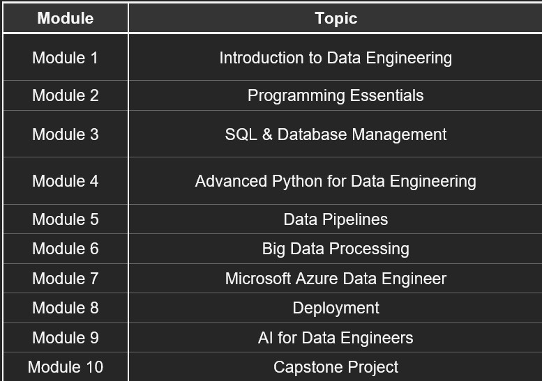

# DEPI Data Engineering Training Repository

Welcome to the **DEPI Data Engineering Training Repository**. This repository contains all the materials, resources, and references for the DEPI Data Engineer track. It is designed to provide a structured learning path for participants, helping them access all training sessions, exercises, and supplementary content in one place.

## Training Schedule Overview


---

## Training Roadmap


---

## Training Modules



---


## Repository Structure

The repository is organized in a way that makes it easy to navigate:
```
repo-root/
├── README.md
├── assets/
│   ├── Training_Modules.jpg
│   ├── Training_Roadmap.jpeg
│   └── Training_Schedule_Overview.jpeg 
└── Materials/
│   ├── Session_01/
│   └── ....../
└── Tasks/
    ├── Task_01/
    └── ...../

```
