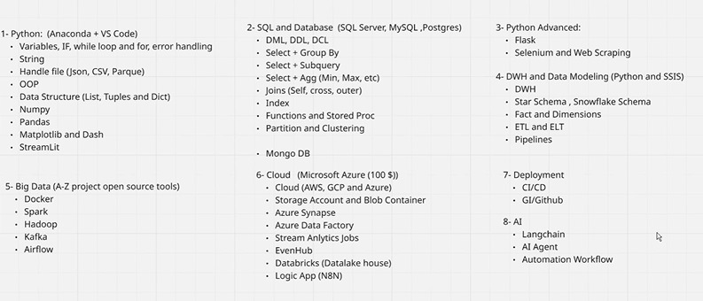

# DEPI Data Engineering Training Repository

Welcome to the **DEPI Data Engineering Training Repository**. This repository contains all the materials, resources, and references for the DEPI Data Engineer track. It is designed to provide a structured learning path for participants, helping them access all training sessions, exercises, and supplementary content in one place.

## Repository Structure

The repository is organized in a way that makes it easy to navigate:


## Training Schedule Overview


```markdown

```

## Training Roadmap


```markdown

```

## Training Modules


```markdown

```


```
repo-root/
├── README.md
├── assets/
│   ├── schedule.png
│   └── modules.png
└── Materials/
    ├── Session_01/
    └── Session_02/
```
